# Widora How-To

`by zymxjtu`

## 用Clion开发OpenWrt C/C++程序 交叉编译 远程调试

## 1 版权
本文基于zymxjtu的 <用Eclipse开发OpenWrt C/C++程序 交叉编译 远程调试> 的工作成果。 更新了Clion的操作方式。

https://github.com/zym060050/Widora_Doc/blob/master/How_To/Widora_How_To_%E7%94%A8Eclipse%E5%BC%80%E5%8F%91OpenWrt_C_C%2B%2B%E7%A8%8B%E5%BA%8F_%E4%BA%A4%E5%8F%89%E7%BC%96%E8%AF%91_%E8%BF%9C%E7%A8%8B%E8%B0%83%E8%AF%95.md

This work is licensed under the Creative Commons Attribution-ShareAlike 3.0 Unported License. To view a copy of this license, visit http://creativecommons.org/licenses/by-sa/3.0/ or send a letter to Creative Commons, 444 Castro Street, Suite 900, Mountain View, California, 94041, USA.

## 2 版本历史
| 版本 | 日期 | 作者 | 更改记录 |
|--------|--------|--------|--------|
|    v0.1    |    15 Feb 2017    |   zymxjtu   (yf添加Clion操作说明)    |    第一版    |

## 3 介绍
这篇文档解释了怎样使用Clion与OpenWrt的交叉编译工具链；怎样设置Eclipse做远程目标设备代码级别的调试和远程操控。

这里展示了怎样为OpenWrt目标设备编写代码，编译，还有调试程序，我们可以使用Clion为OpenWrt目标设备开发软件。

## 4 准备工作

### 4.1 准备工作

#### 4.1.1 目标设备准备工作

下面列出了目标设备需要的软件包:
1. 安装有DropBear 或者 OpenSSH，可以用SSH连接到设备
2. openssh-sftp-server
3. gdbserver
4. libstdcpp (可选，做C++开发需要)

openssh-sftp-server 和 gdbserver 都可以提前编译到OpenWrt的固件里，当然如果没有预装，我们可以简单的通过下面方法安装:
1. SSH 到 OpenWRT. (对于Widora，我们也可以通过板载串口终端，详细信息看使用指南`"Widora_用户指南_1_开始之前"`)
2. 运行 `opkg update` 然后 `opkg install libstdcpp`
3. 运行 `opkg update` 然后 `opkg install openssh-sftp-server`
4. 运行 `opkg install gdbserver` 安装 gdbserver。

  

  

对于Widora，如果Widora是连去一个路由器，然后开发电脑也是连接到同一个路由器，而不是直接连接到Widora，那么想要SSH访问Widora，我们需要更改Widora的防火墙设置。更改Widora防火墙的配置文件`/etc/config/firewall`，更改 config zone wan, option input 设置为 `ACCEPT`, 而不是默认的 `REJECT`, 保存改动之后，重启Widora:

默认:

  

更改之后:

  

然后远程SSH测试下可不可以SSH连到Widora （这里路由器为Widora分配的地址是192.168.8.180，你的环境分配的IP地址可能不同）：

  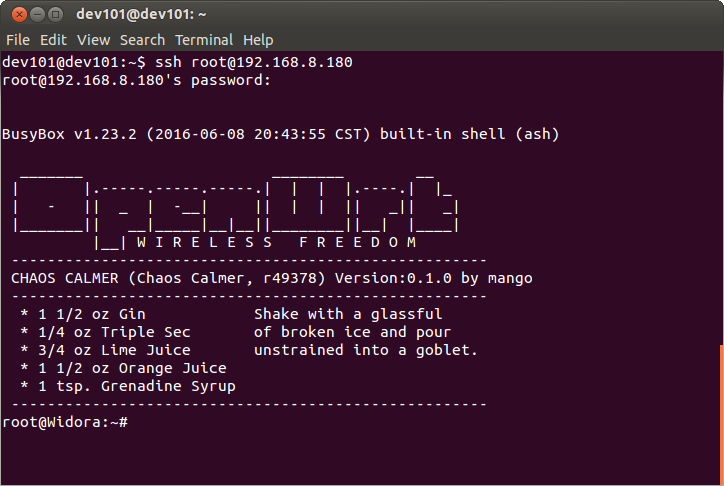


#### 4.1.2 OpenWRT 准备工作

准备 OpenWrt Buildroot 开发环境:

遵照“Widora-NEO开源硬件用户手册V04.pdf”。

以下连接供参考：
https://github.com/widora/openwrt_widora

http://wiki.openwrt.org/doc/howto/buildroot.exigence

对于Widora使用的OpenWrt Chaos Calmer版本，gdb存在一个问题，详细的信息可以参考下面链接：

https://dev.openwrt.org/ticket/22360

https://dev.openwrt.org/changeset/46298/trunk/toolchain/gdb

这个问题之后在我们调试程序的时候可能会导致如下问题:

  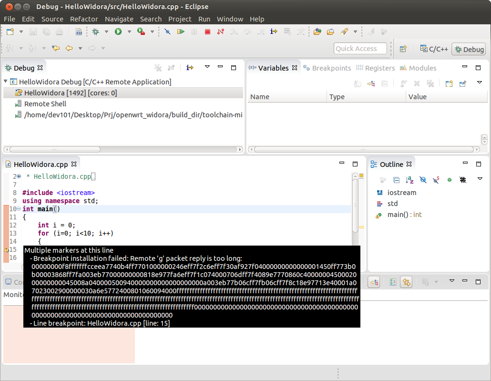

所以对于Widora，这里需要对源码的一个地方做一点改动。
 `{Widora源码目录}/toolchain/gdb/Makefile` (如下图所示加入一行 "--with-expat \\"):

  

之后我们还需要安装依赖库"libexpat1-dev":
```
sudo apt-get install libexpat1-dev
```

我在此处修改后仍然出错.

采用一下方法解决:

1. ~/openwrt_widora/build_dir/target-mipsel_24kec+dsp_uClibc-0.9.33.2/gdb-7.8/gdb/remote.c
注释掉  if (buf_len < 2 * rsa->sizeof_g_packet)     对buf_len的判断


2. 注意改makefile或者代码之后先运行 make toolchain/gdb/clean   再重新编译


在Terminal里面cd到Widora源码的根目录，然后执行 “make menuconfig”:

  

然后:
1. 设置Widora的 "Target System", "Subtarget", "Target Profile".
2. 选择 [ * ] Build the OpenWrt SDK
3. 选择 [ * ] Package the OpenWrt-based Toolchain
4. 选择 [ \* ] Advanced configuration options (for developers) ---> Enable [ \* ] Toolchain Options ---> Enable [ \* ] Build gdb
5. 保存设置.

  

  

  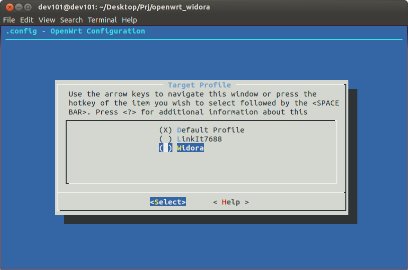

  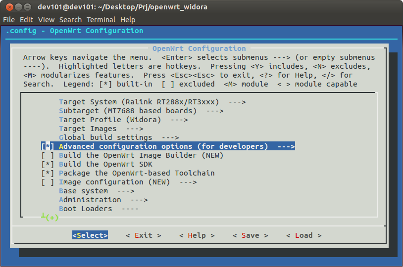

  

  

  

执行 “make toolchain/install” . 这一步的目的是准备我们之后需要用到的交叉编译工具链还有程序调试所需要的gdb.

  

  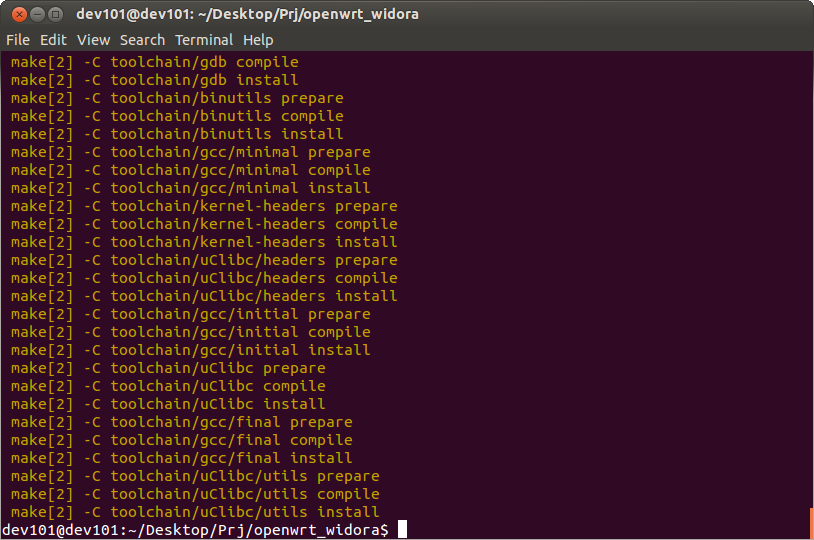


#### 4.1.3 Clion 准备工作

下载你喜欢的 Clion 版本.

对于这篇指引，我们用的是 Clion 2016.3, license可以通过某宝购买大概20几rmb.

https://www.jetbrains.com/clion/


## 5 工程配置

### 5.1 Clion 交叉编译工程的配置

#### 5.1.1 配置 Clion

新建一个工程: `File → New Project (resp. C project)`:

  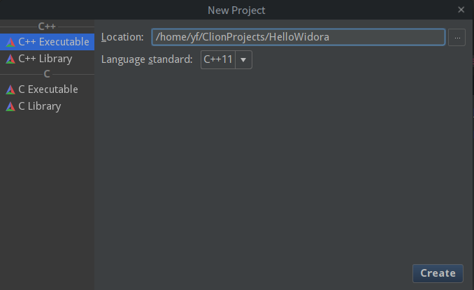

下面的设置是和你的目标设备还有你的OpenWrt开发环境相关的，你需要查看你开发环境独特的设置。

由于Clion是采用CMake生产Makefile的,所以需要先给CMake配置环境.

CMake的所有配置都在CMakeList.txt文件.所以先将widora的Openwrt工具链配置到到CMakeList.txt.

```
##### debian ubuntu 交叉编译工具 #####
SET(CMAKE_C_COMPILER "/home/yf/openwrt_widora/toolchain/bin/mipsel-openwrt-linux-uclibc-gcc")
SET(CMAKE_CXX_COMPILER "/home/yf/openwrt_widora/toolchain/bin/mipsel-openwrt-linux-uclibc-g++")
SET(CMAKE_AR "/home/yf/openwrt_widora/toolchain/bin/mipsel-openwrt-linux-uclibc-ar")
SET(CMAKE_LINKER "/home/yf/openwrt_widora/toolchain/bin/mipsel-openwrt-linux-uclibc-ld")
SET(CMAKE_RANLIB "/home/yf/openwrt_widora/toolchain/bin/mipsel-openwrt-linux-ranlib")
SET(CMAKE_NM "/home/yf/openwrt_widora/toolchain/bin/mipsel-openwrt-linux-nm")
SET(CMAKE_OBJDUMP "/home/yf/openwrt_widora/toolchain/bin/mipsel-openwrt-linux-objdump")
SET(CMAKE_OBJCOPY "/home/yf/openwrt_widora/toolchain/bin/mipsel-openwrt-linux-objcopy")
SET(CMAKE_STRIP "/home/yf/openwrt_widora/toolchain/bin/mipsel-openwrt-linux-strip")
#############################
include_directories( "~/openwrt_widora/build_dir/target-mipsel_24kec+dsp_uClibc-0.9.33.2/linux-ramips_mt7688/linux-3.18.29/include" )
```

**不要忘了你的开发环境应该会和写这篇指引所用的环境不同，不能闭着眼睛复制黏贴!**

修改文件后会自动弹出黄色按钮,选择Reload changes.

  

#### 5.1.2 Clion 工程设置

在这里，我们用之前创建的HelloWidora工程做示范,展示如何设置Clion对远程目标设备进行代码级别的调试和远程访问。

源码已自动生成:

  

如果一切配置正确的话，现在你应该可以交叉编译代码了 `Run > Build` 。

生成的程序肯定是不能在开发电脑上直接运行的，因为我们是用交叉工具链编译的可以跑在Widora上的MIPS架构的二进制可执行文件。

  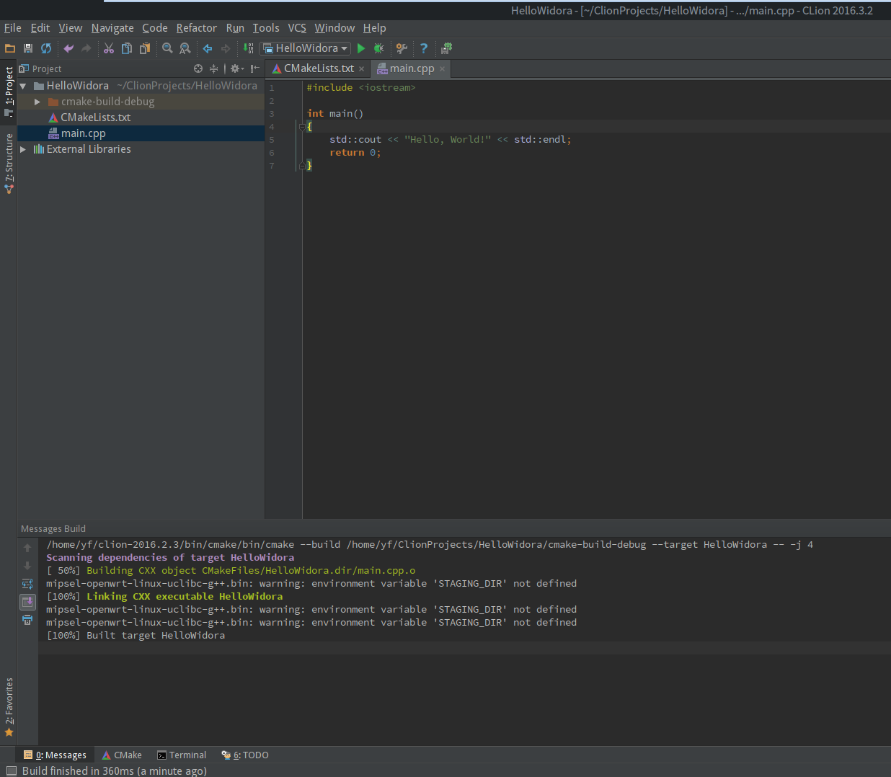

##### 5.1.2.1 启动远程目标设备的gdbserver（Widora）

如果你的程序编译成功，你需要在你的目标设备上执行你所写的程序. Clion没有与eclipse类似的自动化远程访问和远程调试功能.

所以需要手动用Xftp等工具,sftp连接到widora, 然后把程序拷贝到widora, 并且手动运行gdbserver.

在~/ClionProjects/HelloWidora/cmake-build-debug/  找到HelloWidora可执行程序, 在Xftp拖拽到widora的 /tmp目录.

  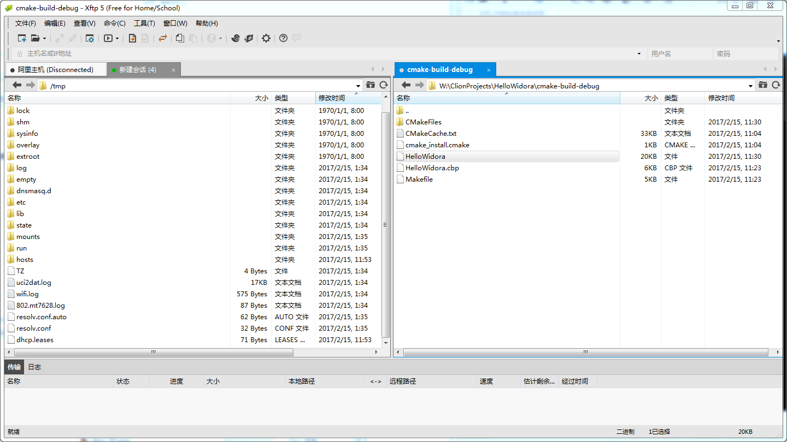

运行如下命令启动程序:
    `chmod 777 HelloWidora`
    `gdbserver :2345 HelloWidora`

  

##### 5.1.2.2 配置Clion的Debug选项

选择菜单 “Run > Edit Configrations”, 按左上角绿色加号, 添加远程调试.

  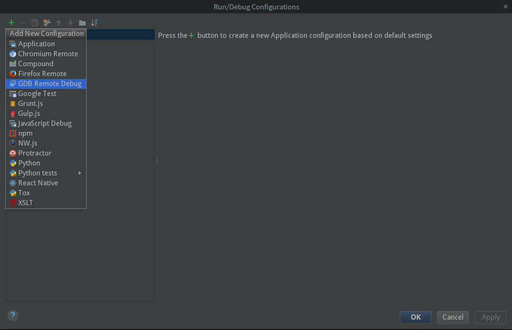

配置参数:GDB 是工具链里的gdb的绝对地址.
target remote 是widora的ip.
symbol file 是编译出的可执行程序.
Path mappings 分别是widora程序路径, 和pc工程路径

  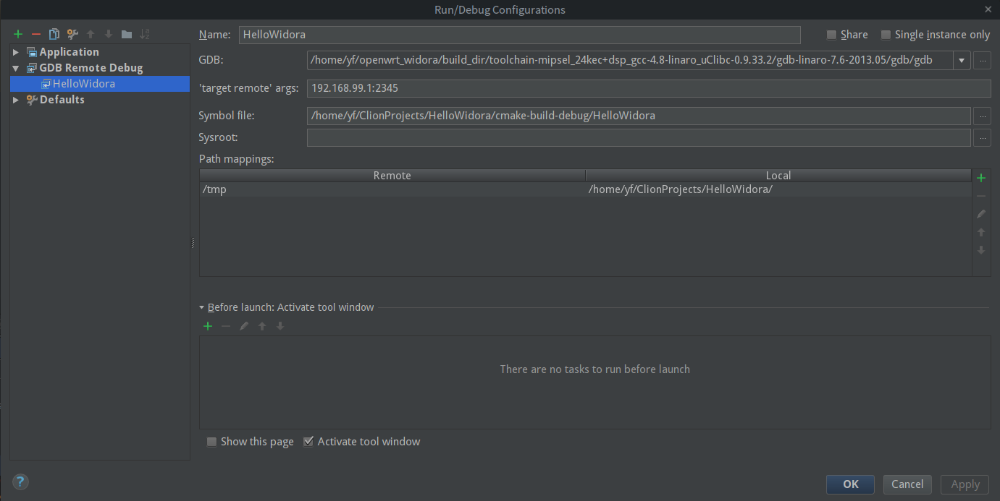

选择 “Run > Debug”, 提示输入密码时请输入widora root 密码.

##### 5.1.2.4 远程调试示例

此时可以进行打断点等操作.

  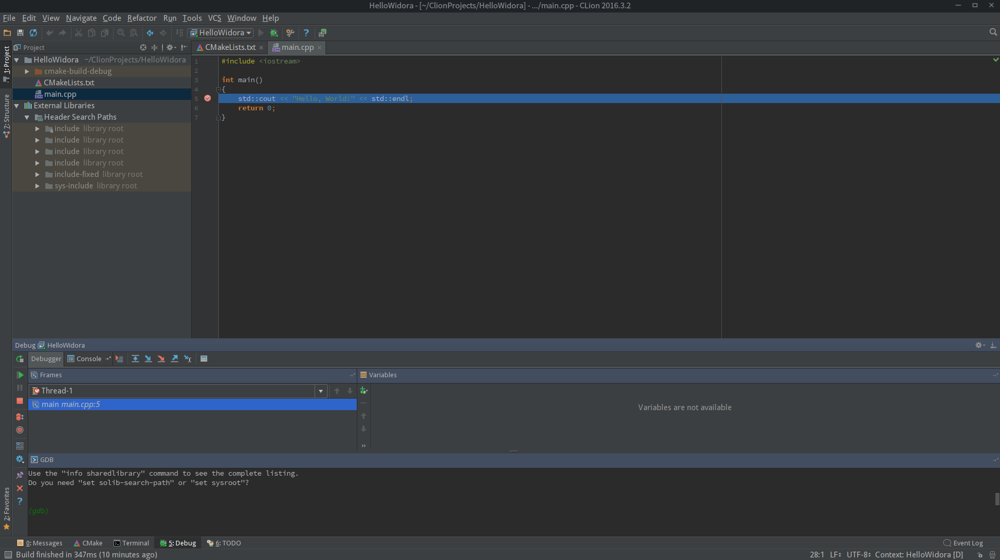

  

上面的警告可以忽略。


## 6 总结

恭喜，你现在已经有一个完整的OpenWrt的IDE开发环境了！你可以在 Clion 里面开发你的OpenWrt C/C++ 程序，交叉编译它，设置断点，远程调试。

至于widora上的手动操作, 确实很不方便. 希望有能力者, 可以编写Clion插件解决这个问题.